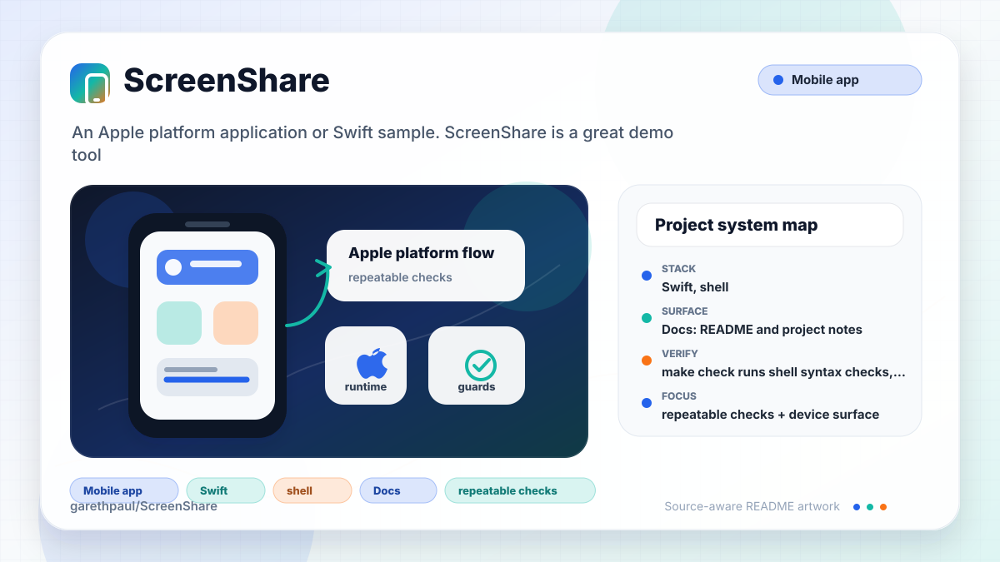
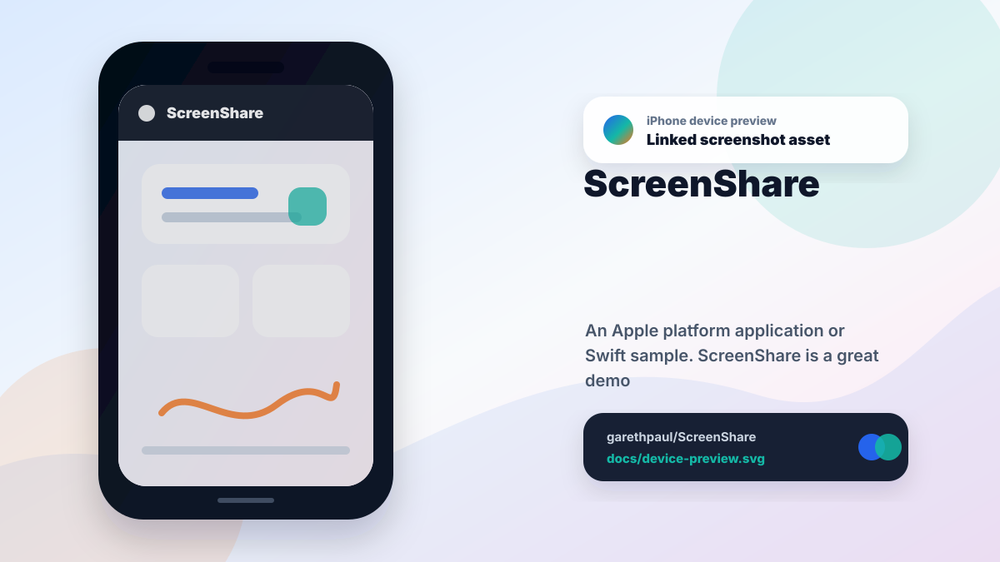

# ScreenShare

<!-- README-OVERVIEW-IMAGE -->


## Device Preview

<!-- DEVICE-PREVIEW-IMAGE -->


## Overview

`garethpaul/ScreenShare` is an Apple platform application or Swift sample. ScreenShare is a great demo tool that allows you to mirror your iOS devices to your screen to create the perfect demo.

This README is based on the checked-in source, manifests, scripts, and repository metadata on the `master` branch. The project language mix found during review was: Swift (9), shell (1).

## Repository Contents

- `README.md` - project overview and local usage notes
- `build.sh`
- `CHANGES.md` - maintenance history for build and privacy checks
- `Makefile` - local verification entry points
- `docs/plans` - completed maintenance plans for the current baseline
- `plans` - historical implementation notes
- `scripts` - static project and behavior validators
- `ScreenShare` - source or example code
- `Screenshare.xcodeproj` - Xcode project file
- `ScreenShareTests` - source or example code
- `ScreenshareUITests` - source or example code
- `SECURITY.md` - security reporting and disclosure guidance
- `VISION.md` - project direction and maintenance guardrails

Additional scan context:

- Source directories: ScreenShare, ScreenShareTests, ScreenshareUITests
- Dependency and build manifests: none detected
- Entry points or build surfaces: build.sh, Screenshare.xcodeproj
- Test-looking files: ScreenShareTests/Info.plist, ScreenShareTests/ScreenShareTests.swift, ScreenshareUITests/Info.plist, ScreenshareUITests/ScreenshareUITests.swift

## Getting Started

### Prerequisites

- Git
- macOS with Xcode for building Apple platform projects
- Python 3 for repository source checks

### Setup

```bash
git clone https://github.com/garethpaul/ScreenShare.git
cd ScreenShare
```

The setup commands above are derived from repository files. Legacy mobile, Python, or JavaScript samples may require older SDKs or package versions than a modern workstation uses by default.

## Running or Using the Project

- Open `Screenshare.xcodeproj` in Xcode, choose the app or sample scheme, and run it on the matching simulator/device.
- Run `./build.sh` when the required platform toolchain is installed.

## Testing and Verification

- `make check` runs shell syntax checks, static Xcode project checks, and
  capture permission/runtime-error metadata checks. When `xcodebuild` is
  installed, the `build` target also builds the shared app scheme with code
  signing disabled.
- Static behavior checks also guard local device-settings archive decoding
  against force-cast crashes.
- Static behavior checks require live capture-device settings construction to
  be nonfailable and force-unwrap-free.
- Static behavior checks also reject debug logging of device names and saved
  window rectangles from local settings.
- Static behavior checks also keep missing local settings from clearing the
  active capture-device list.
- Static behavior checks also reject ad hoc `print`/`println` logging in app
  Swift sources while preserving explicit runtime-error diagnostics.
- Static behavior checks also ensure preview aspect updates compare both video
  width and height against the stored dimensions.
- Static behavior checks also require capture input setup failures to handle
  missing `NSError` metadata without force unwrapping.
- Static behavior checks also require document preview setup and aspect updates
  to optional-bind outlets, backing layers, input ports, and windows.
- Static behavior checks also require session window setup to avoid
  force-unwrapping the main screen or content view.
- Static behavior checks also require device refreshes to guard the main
  device-list window before hiding or showing it.
- Static behavior checks also require document aspect timers to be replaced and
  invalidated when their windows close.
- Static behavior checks also reject force-casting the application delegate and
  require skin selection/settings coordination to tolerate unavailable state.
- Static project checks also require completed canonical plans under `docs/plans`.
- GitHub Actions runs the static `make check` baseline on Ubuntu 24.04 and an
  unsigned app build on macOS 15, with pinned Node 24-compatible actions,
  read-only permissions, disabled checkout credential persistence, fixed runner
  images, and bounded timeouts.
- The shared Xcode project uses Swift 5 language mode and targets macOS 10.13
  or newer so current Xcode releases can compile it.
- Xcode's test action or `xcodebuild test` with the appropriate scheme and
  destination can be used on macOS for deeper verification.

When the required SDK or runtime is unavailable, use static checks and source review first, then verify on a machine that has the matching platform toolchain.

## Configuration and Secrets

- No required secret or credential file was identified in the repository scan. If you add integrations later, keep secrets out of git.

## Security and Privacy Notes

- Review changes touching authentication or token handling; examples from the scan include ScreenShare/AppDelegate.swift, ScreenShare/Document.swift, ScreenShare/NotificationManager.swift, ScreenShare/Skin.swift.
- Review changes touching network requests, sockets, or service endpoints; examples from the scan include ScreenShare/Info.plist, ScreenShareTests/Info.plist, ScreenshareUITests/Info.plist.
- Review changes touching mobile permissions or privacy-sensitive device data; examples from the scan include ScreenShare/Skin.swift.
- Review changes touching file, media, JSON, XML, CSV, OCR, or data parsing; examples from the scan include ScreenShare/Info.plist, ScreenShare/Skin.swift, ScreenShareTests/Info.plist, ScreenshareUITests/Info.plist.

## Maintenance Notes

- This looks like an Apple platform project or sample. Xcode, Swift, CocoaPods, and deployment target versions may need to match the original project era.
- See `SECURITY.md` for vulnerability reporting and safe research guidance.
- See `VISION.md` for project direction and contribution guardrails.
- See `docs/plans/2026-06-08-screenshare-baseline.md` for the canonical
  mirroring privacy and runtime-error baseline.
- See `docs/plans/2026-06-08-device-archive-decoding.md` for the local
  device-settings archive guard.
- See `docs/plans/2026-06-08-device-settings-log-privacy.md` for the local
  device-settings logging guard.
- See `docs/plans/2026-06-09-stdout-logging-guard.md` for the app stdout
  logging guard.
- See `docs/plans/2026-06-09-video-height-change-detection.md` for the preview
  video height-change guard.
- See `docs/plans/2026-06-09-missing-settings-device-list.md` for the
  missing-settings device-list guard.
- See `docs/plans/2026-06-09-capture-input-error-guard.md` for the capture
  input error metadata guard.
- See `docs/plans/2026-06-09-document-preview-guard.md` for the document
  preview and aspect optional-binding guard.
- See `docs/plans/2026-06-09-session-window-setup-guard.md` for the session
  window setup guard.
- See `docs/plans/2026-06-09-main-window-refresh-guard.md` for the main
  device-list window refresh guard.
- See `docs/plans/2026-06-10-ci-baseline.md` for the GitHub Actions static
  baseline.
- See `docs/plans/2026-06-10-hosted-macos-build.md` for the hosted unsigned
  macOS build gate.
- See `docs/plans/2026-06-10-document-aspect-timer-teardown.md` for repeating
  preview timer lifecycle cleanup.

## Contributing

Keep changes small and tied to the project that is already present in this repository. For code changes, document the toolchain used, avoid committing generated dependency directories or local configuration, and update this README when setup or verification steps change.
